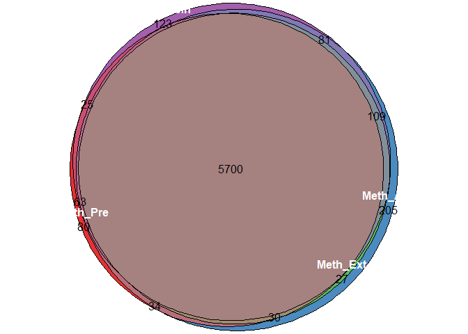
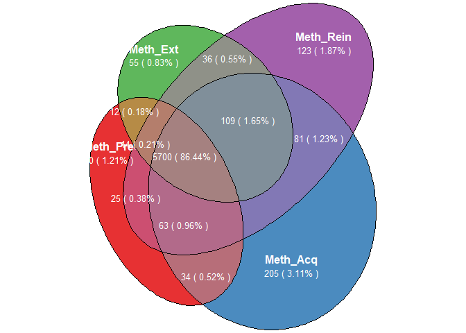

Venn图
================

``` r
library(tidyverse)
library(eulerr)
library(scales)
library(RColorBrewer)
otu_s <- read_tsv("../tax_count.S.norm") %>%
  select(-matches(".*Rein00([6-9]|10)|Sal.*|Taxonomy"))
otu_collapse <- transmute(
  rowwise(otu_s),
  Meth_Pre = max(c_across(contains("Pre"))),
  Meth_Acq = max(c_across(contains("Acq"))),
  Meth_Ext = max(c_across(contains("Ext"))),
  Meth_Rein = max(c_across(contains("Rein")))
)
otu_collapse[otu_collapse>0] <- 1
```

不设置权重时

``` r
fit_orig <- euler(otu_collapse)
fit_orig
```

    ##                                      original   fitted residuals regionError
    ## Meth_Pre                                   80   52.944    27.056       0.004
    ## Meth_Acq                                  205  196.231     8.769       0.001
    ## Meth_Ext                                   55    0.000    55.000       0.008
    ## Meth_Rein                                 123  108.245    14.755       0.002
    ## Meth_Pre&Meth_Acq                          34   54.967   -20.967       0.003
    ## Meth_Pre&Meth_Ext                          12    0.000    12.000       0.002
    ## Meth_Pre&Meth_Rein                         25   53.128   -28.128       0.004
    ## Meth_Acq&Meth_Ext                          27   25.718     1.282       0.000
    ## Meth_Acq&Meth_Rein                         81   92.443   -11.443       0.002
    ## Meth_Ext&Meth_Rein                         36    0.000    36.000       0.005
    ## Meth_Pre&Meth_Acq&Meth_Ext                 30   43.157   -13.157       0.002
    ## Meth_Pre&Meth_Acq&Meth_Rein                63   60.452     2.548       0.000
    ## Meth_Pre&Meth_Ext&Meth_Rein                14    0.000    14.000       0.002
    ## Meth_Acq&Meth_Ext&Meth_Rein               109  116.695    -7.695       0.001
    ## Meth_Pre&Meth_Acq&Meth_Ext&Meth_Rein     5700 5699.949     0.051       0.012
    ## 
    ## diagError: 0.012 
    ## stress:    0

``` r
fill_color <- brewer.pal(4,"Set1") 
plot(fit_orig, quantities = T,
     fills = list(fill = fill_color, alpha = 0.9),
     labels = list(col = "white", font = 2))
```

<!-- -->

都包含的太多。所以将四个组都有的设置权重0.01

``` r
weights <-
  otu_collapse %>% rowwise() %>% transmute(weights = ifelse(sum(c_across(everything(
  ))) == 4, 0.01, 1))
fit <-
  euler(otu_collapse, shape = "ellipse", weights = weights)
quantity <- tibble(
  count = fit_orig[["original.values"]],
  percent = percent(count / sum(count), accuracy = 0.01),
  all = paste(count,"(",percent,")")
)
plot(fit, quantities = list(labels=quantity$all,col = "white",cex=0.8),
     fills = list(fill = fill_color, alpha = 0.9),
     labels = list(col = "white", font = 2))
```

<!-- -->
